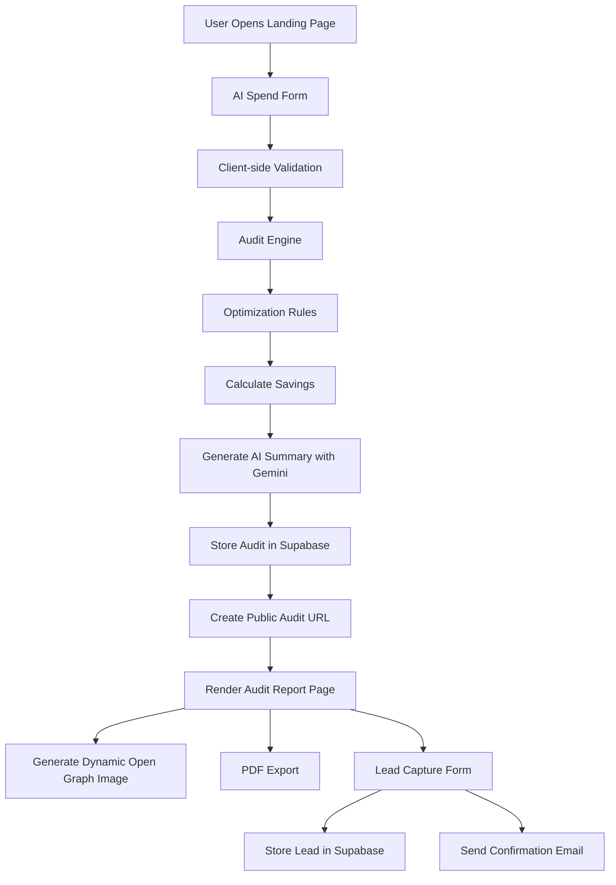

# ARCHITECTURE.md

# StackSpend — System Architecture

## Stack Choice

### Frontend
- **Next.js 15 (App Router)**  
  Chosen for server-side rendering, dynamic metadata generation, route-based architecture, API routes, and easy deployment on Vercel. The App Router also simplified dynamic audit pages and Open Graph image generation.

- **React + TypeScript**  
  TypeScript was used across the application for safer data handling, predictable audit objects, and maintainable business logic in the audit engine.

- **Tailwind CSS**  
  Used for rapid UI iteration and responsive layouts without relying on prebuilt dashboard templates.

### Backend & Database
- **Supabase**
  Used for storing generated audits and captured leads. Supabase provided a fast setup with hosted Postgres and simplified database operations.

### AI Integration
- **Google Gemini API**
  Used to generate personalized audit summaries. AI was intentionally limited to summary generation only. All pricing calculations and optimization logic use deterministic hardcoded rules for reliability and explainability.

### Deployment
- **Vercel**
  Chosen because it integrates well with Next.js App Router, supports dynamic routes, server rendering, Open Graph image generation, and fast deployments.

---

# System Architecture Diagram

# Data Flow

1. User Input
Users select AI tools they currently use, including:

- plan type
- monthly spend
- number of seats
- team size
- primary use case

The form state persists locally using browser storage so users do not lose progress on refresh.

2. Audit Engine Processing

Once the user submits the form:

- the audit engine evaluates each tool
- compares current plans against pricing rules
- identifies downgrade opportunities
- suggests cheaper alternatives
- estimates savings through infrastructure credits

The audit engine is deterministic and rule-based rather than AI-generated because financial recommendations need predictable reasoning.

3. AI Summary Generation

After savings calculations are complete:

- a structured prompt is sent to Gemini
- Gemini generates a personalized summary paragraph
- if the API fails or rate limits occur, the system falls back to a templated summary

This prevents broken audit pages and keeps the experience reliable.

4. Database Storage

The completed audit is stored in Supabase with:

- audit metrics
- optimization insights
- generated summary
- timestamp

Personally identifiable information is intentionally excluded from public audit pages.

5. Public Audit URL

Each audit receives a unique public route:
`/audit/[id]`

The page dynamically renders:

- savings metrics
- optimization insights
- AI summary
- sharing functionality
- downloadable PDF export

6. Open Graph Preview Generation
Dynamic Open Graph images are generated using Next.js opengraph-image.tsx.

This allows audit links shared on:

- WhatsApp
- Twitter/X
- LinkedIn

to display rich previews with savings information.

## Audit Engine Design

The audit engine uses static pricing logic and rule evaluation instead of AI-generated calculations.

Examples:
- recommending Cursor Pro instead of Business for very small teams
- detecting duplicate overlapping subscriptions
- suggesting API usage instead of premium seat licenses
- identifying when enterprise plans are unnecessary

This approach improves:

- explainability
- consistency
- predictable outputs
- testability

The logic is modularized so new vendors and pricing models can be added easily.

## Database Design
1. audits table Stores:

- audit ID
- current spend
- optimized spend
- savings
- insights
- AI summary
- timestamps

2. leads table stores:

- email
- company name
- role
- team size
- associated audit ID

Lead information is separated from public audit pages for privacy.

## Why I Chose This Stack
1. Why I Chose This Stack:
- Built-in routing
- Server rendering
- API routes
- Metadata generation
- OG image support
- Excellent Vercel integration

2. Why TypeScript

The project contains pricing calculations and financial recommendation logic. Type safety reduced runtime bugs and made the audit engine easier to maintain.

3. Why Supabase
Supabase provided:

- managed Postgres
- fast setup
- easy querying
- simple deployment workflow
without needing to manage backend infrastructure manually.

4. Why Tailwind

Tailwind allowed rapid UI iteration while keeping bundle size small and maintaining responsive layouts.

## Performance & Scalability

Current optimizations:

- dynamic route rendering only where necessary
- cached static assets
- lightweight client-side state
- minimal external dependencies
- server-side metadata generation

The audit engine itself is computationally lightweight because it relies on deterministic rule evaluation rather than expensive AI inference.

## What I Would Change For 10k Audits/Day

If this product needed to handle 10,000+ audits per day, I would make the following improvements:

1. Queue AI Summary Generation

Move Gemini requests into a background job queue to avoid blocking page generation.

Possible tools:

- BullMQ
- Upstash Queue
- Cloud Tasks

2. Add Rate Limiting

Introduce:

- IP-based request throttling
- bot protection
- edge middleware rate limiting

to reduce abuse.

3. Database Optimization
add indexing for audit lookup
separate analytics workload from transactional workload
introduce read replicas if traffic increases significantly

4. CDN Caching
Cache generated Open Graph images and public audit pages at the CDN edge for faster global delivery.

------

## Final Notes

The architecture intentionally prioritizes:

- simplicity
- explainability
- fast iteration
- maintainability

over premature complexity.

The goal of the project was to build a realistic MVP that could plausibly launch publicly while remaining understandable and testable.